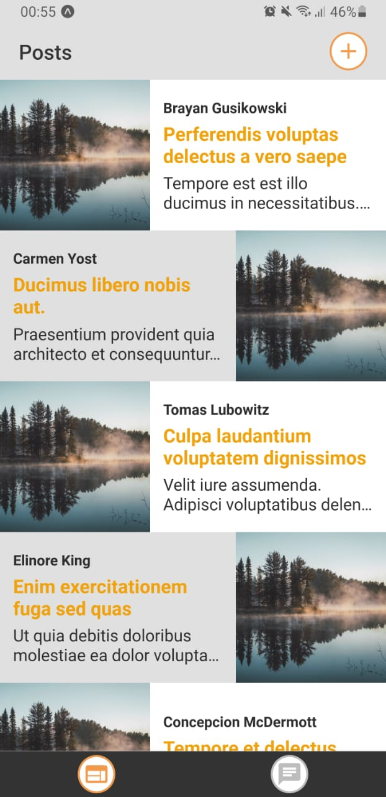
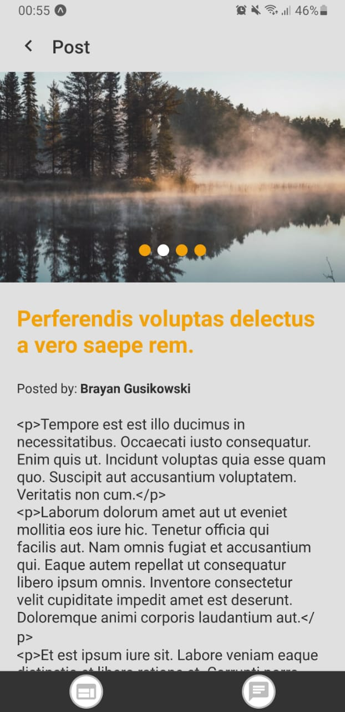
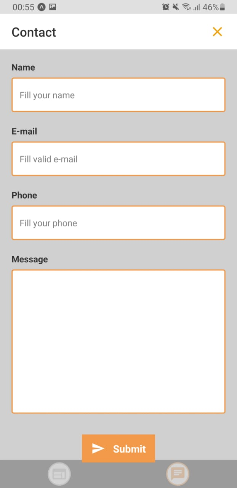

<h4 align="center">
    
</h4>

  
  
  
  
  

  <a href="#sobre">Sobre</a>&nbsp;&nbsp;&nbsp;|&nbsp;&nbsp;&nbsp;
  <a href="#tecnologias-utilizadas">Tecnologias</a>&nbsp;&nbsp;&nbsp;|&nbsp;&nbsp;&nbsp;
  <a href="#layout">Layout</a>&nbsp;&nbsp;&nbsp;|&nbsp;&nbsp;&nbsp;
  <a href="#como-usar">Como usar</a>&nbsp;&nbsp;&nbsp;|&nbsp;&nbsp;&nbsp;
  <a href="#license">Licença</a>

## :bookmark: Sobre

Este repositório é o resultado para o **teste de recrutamento mobile** da [Coderockr](https://github.com/Coderockr)

## :rocket: Tecnologias Utilizadas

Esse projeto foi desenvolvido com as seguintes tecnologias:

- [React Native](https://reactnative.dev/)
  - Framework para desenvolver aplicativos hibridos de forma nativa com JavaScript.
- [Expo](https://expo.io/)
  - O **Expo** é um framework que facilita o desenvolvimento do projeto.
  - Ele já nos trás algumas ferramentas já configuradas, como por exemplo o **expo vector-icons**
  - No projeto, foi utilizado para trazer agilidade no desenvolvimento.
- [Styled Components](https://styled-components.com/)
  - O styled-components é uma biblioteca para estilos no ReactJS e React Native usando CSS-in-JS.
  - No projeto, foi utilizado para facilitar na criação de estilos.
- [Axios](https://github.com/axios/axios)
  - O axios é uma lib para conexões HTTP.
  - No projeto, eu utilizei ele para trazer as informações da API.

## 🎨 Layout

O layout proposto para o teste está disponível no [Figma](https://www.figma.com/file/LA0NAQljFwhY8KfDUijKVBhF/Coderockr-Mobile-Test)

## :iphone: Resultado

<h1 align="center">
  
  
  
</h1>

## :fire: Pré-requisitos

Para rodar este projeto, é necessário ter instalado na sua máquina as seguntes tecnologias:

- [Node.js](https://nodejs.org/en/)
- [NPM](https://www.npmjs.com/) ou [Yarn](https://yarnpkg.com/)
- [Expo](https://expo.io/)

## :zap: Como usar

1. Faça um clone desse repositório: `git clone https://github.com/vitorserrano/coderockr-mobile-test.git`
2. Instale as dependências: `npm install` ou `yarn`
3. Inicie a aplicação: `npm start` ou `yarn start`

## :memo: License

Esse projeto está sob a licença MIT. Veja o arquivo [LICENSE](LICENSE.md) para mais detalhes.

---

<h4 align="center">
    Feito com 💜 by <a href="https://www.linkedin.com/in/vitor-serrano/" target="_blank">Vitor Serrano</a>
</h4>
